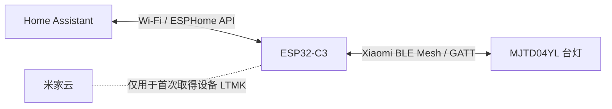
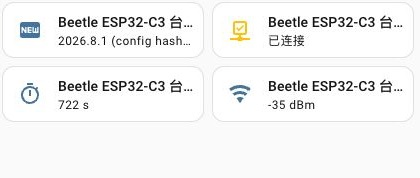

# MJTD04YL ESPHome 本地网关

Home Assistant 能认出这盏台灯，却控制不了它；手边正好有一块闲置的 ESP32-C3。这个项目就是从这里开始的。

它让 Beetle ESP32-C3 留在台灯旁边，负责完成 Xiaomi BLE Mesh 登录与加密通信，再通过 ESPHome Native API，把开关、亮度和色温交给 Home Assistant。控制链路留在局域网与蓝牙范围内，不需要米家网关转发每条指令。

<p align="center">
  
  &nbsp;&nbsp;&nbsp;
  
</p>

<p align="center"><em>左：MJTD04YL 产品图；右：DFRobot Beetle ESP32-C3 官方产品图。<a href="docs/assets/README.md">图片来源与说明</a></em></p>

这是根据实机通信调试出来的第三方实现，目前只在 DFRobot Beetle ESP32-C3 v1.0.0 与 `MJTD04YL`（`yeelink.light.lamp21`）上验证。它不是小米或 ESPHome 官方组件。

## 已实现

| 功能 | 状态 |
|---|---|
| BLE Mesh 本地登录（P-256、HKDF、AES-CCM） | 已验证 |
| 开关、1–100% 亮度、2700–6500 K 色温 | 已验证 |
| Home Assistant 状态回传 | 已验证 SET ACK / result 与设备通知 |
| 纯网关固件 | `esphome/beetle-esp32-c3-gateway.yaml` |
| OLED 气候面板固件 | `esphome/beetle-esp32-c3.yaml` |
| ESPHome API 加密与 OTA 密码 | 已启用 |



<p align="center">
  
</p>

<p align="center"><em>本机 Home Assistant 实际在线状态：固件版本、连接状态、运行时间与 Wi-Fi 信号均已回传。</em></p>

## 快速开始

需要 Python 3.12+、ESPHome 2026.8.1+、一块 ESP32-C3，以及已经绑定在自己米家账号下的台灯。

```sh
python3 -m venv .venv-esphome
source .venv-esphome/bin/activate
pip install -r requirements-esphome.txt

python3 tools/generate_esphome_secrets.py
# 编辑 esphome/secrets.yaml，填写台灯 MAC 与 gatt_ltmk

# 二选一：纯网关，或 OLED 版
esphome run esphome/beetle-esp32-c3-gateway.yaml
esphome run esphome/beetle-esp32-c3.yaml
```

首次刷写后可通过临时热点或 Improv Serial 配置家庭 Wi-Fi。随后在 Home Assistant 中添加 ESPHome 集成，填写节点 IP 与 `secrets.yaml` 中的 API 加密密钥。

从“为什么官方实体不可用”、取得 LTMK，到 OLED 接线和真实故障截图，都写在[完整中文实践记录](docs/mjtd04yl-esphome-gateway-tutorial.md)里。两套配置的硬件差异见 [ESPHome 配置说明](esphome/README.md)。

## 为什么没有通用 BIN

每盏已经绑定的台灯都有独立 `gatt_ltmk`。它既是 ESP32 登录台灯的长期密钥，也会被编译进固件。API 密钥、OTA 密码和设备 MAC 同样属于本地配置，因此公开一个“下载即刷”的二进制既不能通用，也会泄露凭据。

仓库提供完整固件源码与可复现构建。编译生成的 `firmware.factory.bin` 和 `firmware.ota.bin` 只留在本机 `esphome/.esphome/`，不要上传到公开 Release。

## 目录

```text
esphome/
├── beetle-esp32-c3-gateway.yaml   # 纯网关
├── beetle-esp32-c3.yaml           # 网关 + 128x64 OLED
├── packages/                      # 两套固件共享配置
└── components/mijia_mesh_light/   # 自定义 BLE Mesh light 组件
tools/                             # 密钥、登录与 API 冒烟测试工具
docs/                              # 教程、图片与实现审查记录
compose*.yaml                      # 可选的 Home Assistant Container 环境
```

## 当前限制

- 一块 ESP32 当前只配置一盏台灯；扩展多灯需要增加 BLE client 实例并评估 ESP32-C3 内存。
- 该连接是专用 BLE client，不是通用 Home Assistant Bluetooth Proxy。
- 台灯不会可靠响应直接属性 GET；状态主要来自加密 SET 回执与设备主动通知。
- 网关启动后默认把灯恢复为关闭，避免掉电重启后意外亮灯。
- 如果米家官方集成里仍保留一个不可用的同名云实体，请在仪表盘使用 ESPHome 提供的新实体。

## 安全

`esphome/secrets.yaml`、Home Assistant 运行数据库、日志和第三方集成副本均已从版本控制排除。不要在 Issue、截图或编译日志中公开 LTMK、API 加密密钥、OTA 密码、米家 token 或账号密码。更多结论见[实现与安全审查](docs/review.md)。

## License

[MIT](LICENSE)
