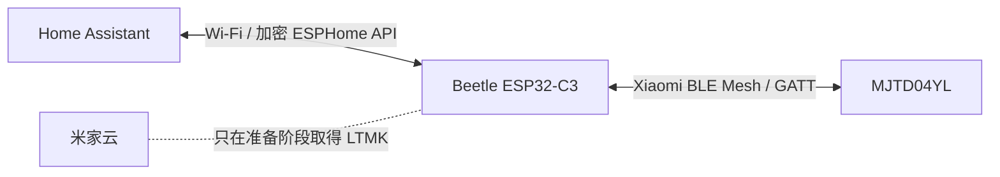
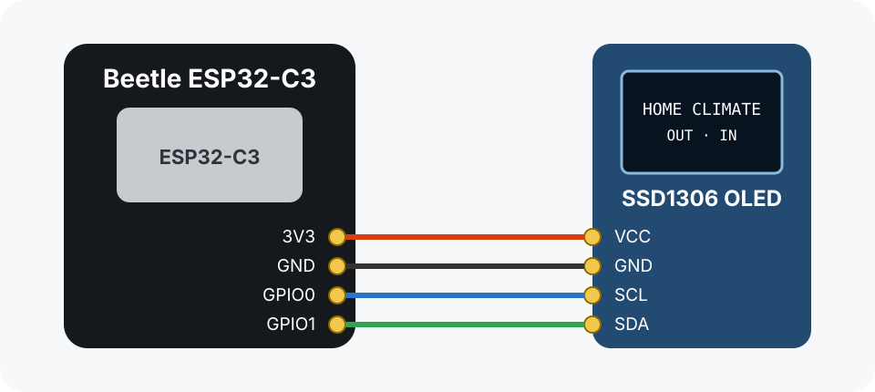
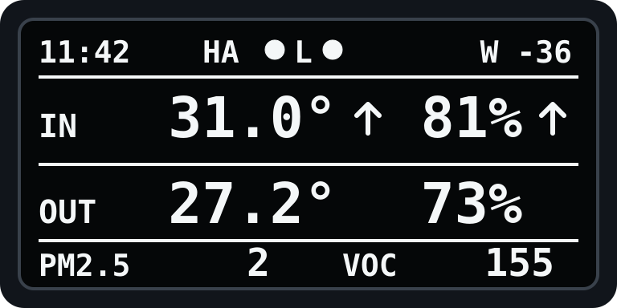
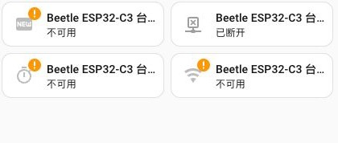

# 我给一盏没有 Wi-Fi 的米家台灯，补了一块 ESP32 本地网关

事情是从 Home Assistant 里一张灰色的台灯卡片开始的。

米家账号已经登录，`MJTD04YL` 也确实被识别成了 `yeelink.light.lamp21`，可实体始终显示“不可用”。重登账号、重载集成都没有改变什么。后来才发现，问题根本不在账号：这盏灯没有 Wi-Fi，日常通信走的是 Xiaomi BLE Mesh。手机靠近时能直接控制；想让它常驻在线，则需要一台懂这套协议的网关。

<p align="center">
  
</p>

<p align="center"><em>图 1：米家智能充电台灯 MJTD04YL。产品图来自 <a href="https://www.gizmochina.com/2021/09/29/xiaomi-launches-the-mijia-smart-rechargeable-desk-lamp-mijia-electric-kettle-2/">Gizmochina 收录的小米发布物料</a>，不是我家的现场照片。</em></p>

手边刚好有一块闲置的 Beetle ESP32-C3。它有 Wi-Fi，也有 BLE，而且体积小到可以藏在桌边。于是方案慢慢清楚了：让 ESP32 留在台灯旁边，负责登录 BLE Mesh、收发加密命令；Home Assistant 只和 ESPHome 的标准 light 实体说话。

这篇文章记录的是已经跑通的实机方案，不是“理论上应该可以”的拼装教程。目前验证组合是：

- 米家智能充电台灯 `MJTD04YL`（`yeelink.light.lamp21`）
- DFRobot Beetle ESP32-C3 v1.0.0
- ESPHome 2026.8.1+
- Home Assistant Container

项目是第三方逆向实现，不属于小米、Yeelight、DFRobot 或 ESPHome 官方组件。

## 最后做成了什么



正常使用时，开关、亮度、色温都走局域网和蓝牙，不需要把每条控制命令绕到云端。米家云只在准备阶段出现一次：取出台灯已经绑定的长期密钥 `gatt_ltmk`。

| 能力 | 当前结果 |
|---|---|
| 开灯 / 关灯 | 已验证 |
| 亮度 1–100% | 已验证 |
| 色温 2700–6500 K | 已验证 |
| HA 状态回传 | 已验证 SET ACK、result 与设备通知 |
| ESPHome API 加密 | 已启用 |
| OTA 密码 | 已启用 |
| 断电后换普通 USB 电源 | 可以，Wi-Fi 与 BLE 会自动重连 |

## 为什么不是 Bluetooth Proxy

这里最容易走错的一步，是把“蓝牙设备接入 HA”直接等同于“刷一个 Bluetooth Proxy”。

代理只负责搬运蓝牙数据；它并不知道这盏灯怎样登录、怎样分片，也不知道命令为什么要用 AES-CCM 加密。`MJTD04YL` 需要的是一个真正参与协议的 BLE client。因此这个项目做的是专用台灯网关，而不是通用蓝牙代理。

## 硬件：一块比台灯底座小得多的板子

<p align="center">
  
</p>

<p align="center"><em>图 2：DFRobot Beetle ESP32-C3（DFR0868）实物图，来自 <a href="https://wiki.dfrobot.com/dfr0868/">DFRobot 官方 Wiki</a>。图中还带着配套 Proto Board，本项目只需要左侧主板。</em></p>

准备这些东西就够了：

- 一盏已经绑定到自己米家账号的 `MJTD04YL`
- 一块 Beetle ESP32-C3；其他 ESP32-C3 可以尝试，但要自行核对引脚
- 一根能传数据的 USB-C 线
- 2.4 GHz Wi-Fi 与可用的 Home Assistant
- Python 3.12+
- 可选：128×64、I2C 接口的 SSD1306 OLED

先把项目拉到本机：

```sh
git clone https://github.com/linyuxuanlin/mjtd04yl-esphome-gateway.git
cd mjtd04yl-esphome-gateway

python3 -m venv .venv-esphome
source .venv-esphome/bin/activate
pip install -r requirements-esphome.txt
```

## 真正的门槛不是刷机，而是 LTMK

说人话，`gatt_ltmk` 就是 ESP32 登录这盏灯时要出示的长期凭据。MAC 地址只告诉我们“灯在哪里”，LTMK 才能证明“我有权控制它”。每盏已绑定设备的值都不同，所以网上不可能存在一个适用于所有人的通用 BIN。

它也应该像密码一样保管：不要贴到 Issue，不要放进教程截图，更不要上传编译后的固件。这个仓库的辅助脚本不会把 LTMK 打印到终端，而是写入权限为 `600` 的临时文件。

另建一个工具环境：

```sh
python3 -m venv .venv-tools
source .venv-tools/bin/activate
pip install -r requirements-tools.txt
```

先找到台灯的 DID。它可以从 Xiaomi Home 的设备诊断信息中取得，也可以按 MiService 的方式临时运行 `miservice list`，确认型号是 `yeelink.light.lamp21` 后再继续：

```sh
python tools/mjtd04yl_qr_ltmk.py \
  --did <你的台灯 DID> \
  --qr /tmp/mjtd04yl-login.png \
  --output /tmp/mjtd04yl-ltmk.json
```

终端出现 `QR_READY` 后，在 macOS 打开二维码：

```sh
open /tmp/mjtd04yl-login.png
```

用自己的小米账号完成确认。看到 `LTMK_READY` 后，把结果安装进 ESPHome 的私密配置：

```sh
python tools/install_mjtd04yl_secret.py
```

这一步依赖非官方公开接口，未来可能随着小米服务调整而变化。账号不是中国大陆区时，还要同步调整 region。不要在来历不明的机器上跑取钥工具。

## 把自己的凭据和仓库分开

生成 API 加密密钥、OTA 密码和临时配网热点密码：

```sh
python tools/generate_esphome_secrets.py
```

然后打开 `esphome/secrets.yaml`，补上台灯的 BLE MAC：

```yaml
mjtd04yl_mac_address: "AA:BB:CC:DD:EE:FF"
```

如果上一节的安装脚本正常完成，`mjtd04yl_gatt_ltmk` 已经在同一个文件里。`secrets.yaml` 被 Git 排除，不要用 `git add -f` 强行提交。

## 先刷最简单的网关版

如果目标只是把灯接入 Home Assistant，先用纯网关版：

```sh
esphome run esphome/beetle-esp32-c3-gateway.yaml
```

第一次通过 USB 刷写；以后节点在线时可以 OTA 更新。固件刷完后，如果板子还没有 Wi-Fi，会出现一个名称以 `Setup` 结尾的临时热点。连上后打开 `http://192.168.4.1/` 填入家庭 Wi-Fi，也可以使用 Improv Serial 配网。

节点上线后，去 Home Assistant：

> 设置 → 设备与服务 → 添加集成 → ESPHome

填写节点 IP，再输入 `esphome/secrets.yaml` 中的 `esphome_api_encryption_key`。成功后应该出现一个“米家智能充电台灯” light 实体，以及“本地连接”诊断实体。

第一次测试我建议按这个顺序，不要一上来就把所有滑块拖来拖去：

1. 先确认“本地连接”为开启。
2. 开灯、关灯各一次。
3. 亮度依次测试 20%、50%、100%。
4. 色温在暖白与冷白之间移动。
5. 拔掉 ESP32，再接到普通 USB 电源，观察它能否自行回到 HA。


*图 3：本机 Home Assistant 的真实在线截图。固件版本、Status、Uptime 与 Wi-Fi Signal 均已恢复；截图已裁掉设备尾号、区域和账号信息。*

## 可选的 OLED：它不是装饰，而是一眼能看懂的状态牌

如果板子旁边还接了 SSD1306 OLED，刷这一份配置：

```sh
esphome run esphome/beetle-esp32-c3.yaml
```

默认接线如下。OLED 模块的丝印可能把电源写成 `VCC` 或 `VIN`，接之前仍要确认自己的模块支持 3.3 V。



*图 4：本项目默认接线。GPIO0 → SCL，GPIO1 → SDA。*

屏幕上方显示 HA API 是否在线；`OUT` 读天气实体里的室外温湿度，`IN` 读空气净化器或其他室内传感器。下面这张图是直接按固件显示代码重绘的等比例示意，不是拿渲染图冒充实拍：



*图 5：128×64 OLED 界面示意。实际字形会受 ESPHome 下载到的 Roboto 字体版本影响。*

把自己 HA 里的实体 ID 填进 `secrets.yaml`：

```yaml
indoor_temperature_entity_id: sensor.example_indoor_temperature
indoor_humidity_entity_id: sensor.example_indoor_humidity
outdoor_weather_entity_id: weather.example_home
```

天气实体的温度和湿度来自属性；室内温湿度则是两个独立 sensor。实体不可用时，屏幕会显示 `--.-°` 或 `--%`，这通常是实体 ID 写错，不是 OLED 坏了。

## 我会怎样判断“到底是哪一段断了”

这套链路有两段：HA ↔ ESP32，以及 ESP32 ↔ 台灯。只说“设备离线”很容易把它们混在一起。

- ESPHome 节点在线，但“本地连接”关闭：Wi-Fi 正常，BLE 登录或距离有问题。
- ESPHome Version、Uptime、Wi-Fi Signal 都不可用，Status 显示已断开：ESP32 自己没上线，先查供电和 Wi-Fi。
- 本地连接正常，但灯不动作：再看台灯是否被米家 App 近距离占用，以及 LTMK 是否属于这盏灯。



*图 6：本机 Home Assistant 的真实断线截图。拍摄时 ESP32 已拔电，所以 Status 显示“已断开”，其余诊断值不可用；截图已裁掉设备尾号、区域和账号信息。*

这张“失败截图”反而很有用：它说明 HA 里的设备卡片不会因为节点断电而消失。看到卡片不等于设备在线，Status 才是更直接的判断依据。

## 几个折腾过一次就不想再踩的坑

### 米家 App 会抢近距离连接

如果手机正停留在台灯控制页，ESP32 可能暂时登录不上。退出设备页，等网关重连即可，不需要重置台灯，更不要急着解绑。

### Wi-Fi 在线不代表 BLE 在线

HA 能看到 ESP32，只能说明 Native API 通了。台灯离板子太远时，“本地连接”仍会关闭。把板子留在台灯附近，比一味给 Wi-Fi 加信号更有效。

### 固件 BIN 也包含秘密

ESPHome 生成的 `firmware.factory.bin` 与 `firmware.ota.bin` 都包含 LTMK、API 密钥和 OTA 密码。可以留在自己的备份里，但不要上传到公开 Release。真正适合分享的是源码、示例和可复现构建过程。

### 同名实体要看来源

米家官方集成可能还留着一个不可用的同名台灯实体。放到仪表盘前先看实体来源，应该选择 Beetle ESP32-C3 设备下的 ESPHome light。

## 现在的边界

- 一块 ESP32 当前只配置一盏台灯。
- 这是专用 BLE client，不是通用 Bluetooth Proxy。
- 台灯不会可靠响应直接属性 GET；状态主要来自加密 SET 回执和设备主动通知。
- 网关启动后默认把灯恢复为关闭，避免掉电重启后意外亮灯。
- OLED 图目前只有等比例示意；要写成真正的装机记录，最好再补一张你自己接线后的现场照片。

做到这里，这盏原本只能在米家生态里“若隐若现”的蓝牙台灯，就变成了 Home Assistant 中一个普通、可自动化、又不依赖云端转发控制的 light 实体。对我来说，这也是这块小板子最合适的归宿：不用承担整个家的蓝牙代理，只安安静静地守在台灯旁边，把一件事做好。

## 参考、图片与致谢

- [DFRobot Beetle ESP32-C3 官方 Wiki](https://wiki.dfrobot.com/dfr0868/)
- [MJTD04YL MIoT Spec](https://miot-spec.org/miot-spec-v2/instance?type=urn:miot-spec-v2:device:light:0000A001:yeelink-lamp21:1:0000C802)
- [ESPHome Packages](https://esphome.io/components/packages/)
- [ESPHome External Components](https://esphome.io/components/external_components/)
- [ESPHome Security Best Practices](https://esphome.io/guides/security_best_practices/)
- [MiService](https://github.com/Yonsm/MiService)
- [Gizmochina：MIJIA Smart Rechargeable Desk Lamp 发布报道](https://www.gizmochina.com/2021/09/29/xiaomi-launches-the-mijia-smart-rechargeable-desk-lamp-mijia-electric-kettle-2/)
- 本项目图片的详细来源与可用范围见 [`docs/assets/README.md`](assets/README.md)。
